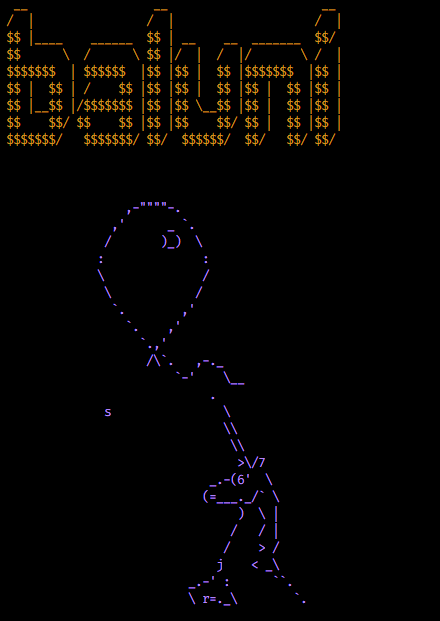

# BALUNI 🎈



BALUNI is an innovative application designed for trading on decentralized exchanges. It offers a range of tools to facilitate trading activities on platforms like Uniswap. BALUNI is tailored to assist both new and experienced traders in managing their cryptocurrency portfolios with ease.

## Prerequisites

Before installing BALUNI, ensure you have Node.js and npm installed on your system. You have to hold USDC into your wallet and MATIC to pay txt fees.

## Installation

To install BALUNI, follow these simple steps:

```shell
yarn install
```

## Usage

### Main Process

Start BALUNI using the following command:

```shell
yarn rebalance
```

for yearn module:

```shell
yarn rebalance-yearn
```

### Modular Features of BALUNI

BALUNI offers a versatile trading strategy that allows for customization by activating or deactivating the following modules:

1. **Market Prediction with AI Module:** The market prediction module in BALUNI has been enhanced to offer advanced customization, allowing users to select specific timeframes, prediction model types, and tokens for their predictive analysis. This feature leverages the latest machine learning technology to provide accurate forecasts on token price movements.
2. **RSI and StochRSI Technical Analysis on Buy and Sell:** By utilizing the Relative Strength Index (RSI) and Stochastic RSI indicators, this module determines overbought or oversold conditions, guiding optimal buy and sell actions.
3. **Using KST Indicator to Capture Bitcoin Trends:** By leveraging the Know Sure Thing (KST) indicator, this module identifies major price trends in Bitcoin, providing valuable insights into bullish or bearish tendencies.
4. **Leveraging Yearn for Interest Generation on Supported Pools:** This module enhances the value of dormant assets between trades by leveraging Yearn Finance to accrue interest on USDC holdings and any other tokens in your portfolio that are supported by Yearn pools. This ensures that, provided you hold tokens that have an associated pool within the Yearn protocol, BALUNI can actively generate interest on those assets, optimizing your investment even when not actively trading.

These modular features elevate the trading experience on BALUNI, offering flexibility and empowering traders with advanced tools for success.

## Additional Tools

### Investor for Uniswap

Edit the configuration file **src/config.ts** with your tokens and weights Select "true" or "false" if you want to sell all the tokens balance before reinvestment.

```shell
yarn invest <sellAll?>
```

### Rebalancer for Uniswap

Edit the configuration file **src/config.ts** with your token and weights

```shell
npx ts-node src/rebalancer.ts
```

### Dollar-Cost Averaging (DCA)

The DCA module allows the user to periodically invest a fixed amount in tokens over time, reducing the impact of volatility. It is set up with a configuration that includes the investment amount, tokens, and intervals.

To use the DCA module, edit the investment configuration in src/config.ts with your desired tokens, investment amounts, and intervals. Execute the script via:

```shell
yarn dca 
```

### Market Prediction

Timeframe Selection: Users can now specify the timeframe for their analysis, choosing from options such as 1 hour, 24 hours, 7 days, etc., to suit their short or long-term trading strategies.

Prediction Model Choice: BALUNI supports a variety of artificial intelligence models, including Linear Regression, Convolutional Neural Networks (CNN), Recurrent Neural Networks (RNN), LSTM (Long Short-Term Memory), and GRU (Gated Recurrent Units). Users can select their preferred model based on data nature and prediction objectives.

Token Selection: Users have the freedom to choose from different tokens for their predictions, customizing the analysis based on the tokens they are interested in the cryptocurrency market.

Available ALGO: REGR, 1CONV, GRU, RNN, LSTM

```shell
yarn prediction bitcoin 60 REGR
```


### Pump-and-dump tool for Uniswap

This tool buys or sells the entire balance of a specified token in the pair

```shell
yarn pumpOrDump <token1> <token2> <action>
```

Command line arguments::

- token1: Reserve token name if configured (eg. WBNB) or token contract address  
- token2: Shit token's name if configured (eg. DARK) or token contract address  
- action: 'pump' | 'dump'

Examples:

```shell
npx ts-node src/pumpOrDump.ts 0xbb4CdB9CBd36B01bD1cBaEBF2De08d9173bc095c 0xBc7d6B50616989655AfD682fb42743507003056D pump
npx ts-node src/pumpOrDump.ts 0xbb4CdB9CBd36B01bD1cBaEBF2De08d9173bc095c 0xBc7d6B50616989655AfD682fb42743507003056D dump
```

### Getting a transaction receipt

A tool for getting a transaction receipt:

```shell
npx ts-node src/getTxReceipt.ts 0xf90efa044b4a5c5a0da0ba1c9dc3c7a5e53962818c6a7a0d496abcab759736fb
```

## Configuration Details

In `src/config.ts`, you can set various parameters for trading strategies. This includes token selections, weights, and whether to sell all tokens before reinvesting.
Modify .env file with your PRIVATE_KEY.

### Tokens and Weights

#### 1. **TOKENS**

- This array lists the addresses of the tokens you are working with.
- Example Tokens:
  - LINK (`0x53E0bca35eC356BD5ddDFebbD1Fc0fD03FaBad39`)
  - WETH (`0x7ceb23fd6bc0add59e62ac25578270cff1b9f619`)
  - and others...
- **To Modify**: Replace these with the token addresses relevant to your strategy.

#### 2. **WEIGHTS_UP** and **WEIGHTS_DOWN**

- These objects define the weights for each token when the price is going up (`WEIGHTS_UP`) and down (`WEIGHTS_DOWN`).
- The weights are in an integer format, which presumably represents their relative importance or allocation in the strategy.
- **To Modify**: Adjust the values to change the weighting of each token under different market conditions.

### Contract Addresses

#### 3. **Stablecoins and Native Tokens**

- `USDC`, `WNATIVE`, and `NATIVE` are set to their respective contract addresses.
- **To Modify**: Update these if you are using different tokens or networks.

#### 4. **Oracle and Router**

- `ORACLE` and `ROUTER` define the addresses for 1Inch OffChain Oracle and Uniswap v3 Router, respectively.
- **To Modify**: Change these addresses if you're using different services or versions.

### Operational Parameters

#### 5. **Limits and Intervals**

- `LIMIT`, `SLIPPAGE`, and `INTERVAL` define operational parameters like transaction limits and intervals.
- **To Modify**: Adjust these values based on your risk management and operational strategy.

#### 6. **Yearn Finance Integration**

BALUNI has expanded its integration with Yearn Finance beyond the initial USDC offering. Now, the platform supports generating interest on a wider range of tokens, provided they have corresponding pools on Yearn Finance and are included within your weighted portfolio configuration. This enhancement allows for a more diversified earning strategy, optimizing the value of idle assets across different cryptocurrencies.

- **Comprehensive Support:** While the initial setup focused on the USDC.e-A AAVE on Polygon vault, BALUNI's latest version broadens this scope. Users can now potentially earn interest on any token supported by Yearn Finance, as long as these tokens are part of the user's portfolio and have designated weights in the configuration settings.
- **Configuration Flexibility:** To take advantage of this extended functionality, ensure that YEARN_ENABLED is set to true in your src/config.ts. Then, specify the Yearn vault addresses for the tokens you wish to earn interest on, similar to how the USDC vault is specified. This setup allows BALUNI to dynamically interact with Yearn Finance, automatically depositing and managing your assets in the appropriate Yearn vaults based on your portfolio's configuration.
- **Dynamic Earning Strategy:** With this update, BALUNI not only trades efficiently on decentralized exchanges but also ensures your assets are continuously working for you, earning interest through Yearn Finance even when market conditions are not favorable for trading. This dual approach maximizes potential returns and provides a more robust investment strategy.
Ensure your portfolio includes the tokens with corresponding Yearn pools you wish to earn interest on, and update your src/config.ts to reflect these preferences. By doing so, you can enhance your investment strategy with BALUNI, leveraging both active trading and passive earning mechanisms for optimal asset growth.

```shell
export const YEARN_VAULTS = {
  "TOKEN_ADDRESS": "YEARN_VAULT_ADDRESS",
  // Add more tokens and their corresponding Yearn vault addresses here
};
```

#### 7. **Dollar-Cost Averaging (DCA)**

- `INVESTMENT_INTERVAL` and `INVESTMENT_AMOUNT` define the frequency and amount for DCA.
- **To Modify**: Adjust these to align with your DCA strategy.

#### 8. **Trend Following and Prediction Module**

**Example PREDICTION_ALGO:** REGR, 1CONV, GRU, RNN, LSTM.

**Example PREDICTION_SYMBOL:** bitcoin, ethereum, litecoin.

**Example PREDICTION_EPOCHS:** 200, 2000.

**Example PREDICTION_PERIOD:** 60.

- Enables trend following and ML analysis.
- Adjust `PREDICTION_PERIOD` and `PREDICTION_EPOCHS` for your analysis period and epochs. Select `PREDICTION_ALGO` and  `PREDICTION_SYMBOL`
- **To Modify**: Toggle `true`/`false` to enable/disable and adjust parameters for your analysis needs.

#### 9. **Technical Analysis**

- Configures parameters for RSI and Stochastic RSI.
- Includes periods and thresholds for overbought/oversold conditions.
- **To Modify**: Adjust these to suit your technical analysis criteria.

## Workflow Overview with Enhanced Yearn Finance Integration

1. **Bot Start**
   - Initialize the trading bot.

2. **Check Prediction Module**
   - Perform forecast with ML analysis to understand market trends.

3. **Check KST Trend**
   - Assess the Know Sure Thing (KST) trend signal to predict the market momentum.

4. **Select Weight Based on Trend Signal**
   - Choose the asset allocation weight according to the trend signal.

5. **Distribute Assets**
   - Allocate assets based on the selected weights.

6. **Technical Analysis Upon Rebalance**
   - When a rebalance occurs, conduct technical analysis using signals like RSI (Relative Strength Index) and Stochastic RSI.

7. **Deposit into Yearn Vaults**
   - Evaluate portfolio for assets eligible for Yearn Finance interest generation. If rebalancing is not triggered or if there are idle assets, deposit them into the corresponding Yearn vaults based on the asset's type and the user's configured Yearn vault addresses. This action is not limited to USDC but extends to all supported tokens in the user's portfolio that have corresponding Yearn pools.

8. **Interest Accumulation**
   - While assets are in Yearn vaults, they accrue interest according to the performance of the selected Yearn pools. This step enhances the value of idle assets, providing an additional revenue stream aside from trading gains.

9. **Withdraw from Vaults for Trading or Rebalancing**
   - Monitor market conditions and portfolio performance. When a trading opportunity arises or rebalancing is necessary, withdraw the appropriate amount of assets from Yearn vaults. This includes converting earned interest back into the portfolio's primary trading assets if desired.

10. **Execute Trades and Rebalance Portfolio**
    - Use the withdrawn assets to execute trades according to the latest market analysis and rebalance the portfolio to maintain the desired asset allocation, optimizing for both trading performance and interest earnings.

This enhanced workflow integrates the dynamic use of Yearn Finance for interest generation, making BALUNI not just a trading bot but a comprehensive DeFi portfolio management tool. It ensures assets are not lying idle but are continually working to generate returns, either through trading or earning interest, thereby maximizing the overall efficiency and profitability of the user's cryptocurrency portfolio.


## Workflow Diagram

```plaintext
1. START
   |
   |─> Trend Selection
   |    ├─> Prediction Module
   |    └─> KST
   |        └─> UP/DOWN
   |            ├─> Weight UP
   !            └─> Weight DOWN
2. Distribute Assets
   |
   |─> Check for Rebalance
   |    │
   |    └─> Technical Analysis  
   |        └──> RSI/STOCHRSI
   |                 ├─> false
   |                 └─> true
   |                         └─> TRADE
3. Earn Interest & Manage Portfolio
   │
   |─> Evaluate Assets for Yearn Vaults
   |    ├─> Eligible Assets Identified
   |    │      └─> Deposit to Corresponding Yearn Vaults
   |    └─> No Eligible Assets or Rebalance Required
   |           └─> Proceed to Rebalance or Trade Execution
   │
   └─> Interest Accumulation
        │
        └─> Rebalance?
                 ├─> false
                 |     └─> Continue Earning Interest
                 |
                 └─> true
                       ├─> Withdraw from Yearn Vaults
                       └─> Execute Trades & Rebalance Portfolio

```

## Tips for Configuration

- **Understand Each Parameter**: Before modifying any values, ensure you understand what each parameter does and how it impacts your trading strategy.
- **Test Changes**: Make changes incrementally and test the impact of each change.
- **Network Compatibility**: Ensure that all contract addresses are compatible with the network you are using (e.g., Ethereum, Polygon).
- **Pools and Tokens**: Verify that each token you're using has an associated liquidity pool on Uniswap V3, paired with either USDC or WMATIC, on your chosen network.
- **Stay Updated**: Keep your configurations up to date with the latest changes in the DeFi space.

## Contributing to BALUNI

We welcome contributions! Please submit pull requests with your proposed changes. Adhere to our coding standards and guidelines for a smooth collaboration process.

## Inspired

This project was ispired by following project:

- <https://github.com/vhalme/dex-bot>
- <https://github.com/MattPereira/etherscript>

## License

BALUNI is released under [GNU AGPLv3](LICENSE.md), which details how it can be used and distributed.

## Contact and Support

For support or to join our community, join our [Telegram Group](https://t.me/+yWNEe13B5pcyNDBk)

For troubleshooting common issues, visit [GitHub Issues](https://github.com/plancia/baluni/issues).
